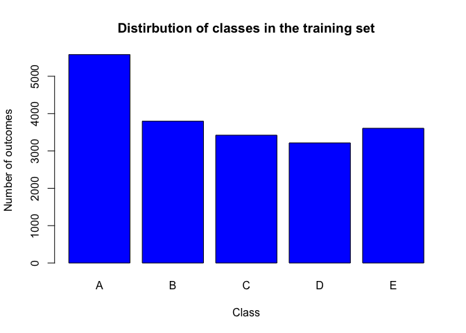
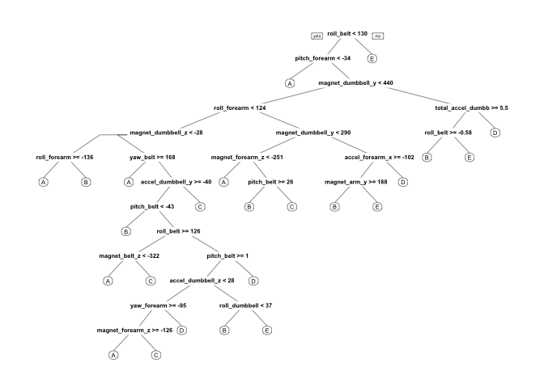

# Practical Machine Learning Project
Todd Curtis  
April 22, 2015  
####Background and Executive Summary
Devices that measure detailed, quantified, information about personal activity allow the measurement of both the quantity and quality of that activity performed by the four study subjects. The data in this project comes from accelerometers placed on the belt, forearm, arm, and dumbell of six participants. They were asked to perform one set of 10 repetitions of barbell lifts correctly, and also incorrectly in four different ways. The correct method was designated class A, and the four incorrect methods were designated class B, C, D, and E.

These five different kinds of outcomes were associated with five distinct output classifications, and were coded as the dependent variable in the training data set.

After evaluating a Random Forest and Classification and Regression Tree (CART) prediction model, the Random Forest model was chosen due to its higher accuracy when tested on the training set.

Based on an evaluation of the accuracy of the Random Forest model using a k-fold cross-validation (with k=10), the estimated out of sample error rate was 0.0035, with a 95% confidence interval of (0.0029, 0.0041).

This model was used on the 20 cases from the test set, with seven of the 20 cases predicted to be in the class associated with the correct barbell lifting method (class A), and at least one case associated with each of the other four classes.

####Project
The goal of the project was to take two sets of data, one a training set and one a testing set, and predict the dependent variable values, specifically one of five distinct classes, associated with the test data.

The major stages of the project including taking training data, using that data to choose an appropriate prediction model, esitmate the out of sample error associated with that model, and then to apply that algorithm to a set of test data.

The data for this project come from  source: http://groupware.les.inf.puc-rio.br/har, and is contained in two files:
- pml-training.csv (19622 rows)
- pml-testing.csv (20 rows)

##### Project Objectives
- Create a report describing how the prediction model was created, 
- Description of how cross validation was used, 
- Create an expected value of the out of sample error (1-accuracy),
- Explain why the chocies in the analysis wer made, and
- Use the prediction model that was created to predict the class associated with 20 test cases. 

####Data
Both sets of data consists of 160 variables. The dependent variable in the training set consists of the values of the five class values associated with the exercise outcomes of the study participants. variables in the training set has 19,622 rows of observations, representing the data from the combinations of study subjects and exercise activities. 

The test set consists of 20 rows of data with independent variables that were identical to those of the training set. Instead of a dependent variable being the exercise classification, the test set had a variable the served as an identifier of the sample.

**Eliminating variables**

A review of the training data revealed that for 100 of the 159 independent variables in the training set had missing or NA data values for roughly 98% of the rows. Those variables (columns) were eliminated from the analyses associated with choosing and evaluating the model.

Also eliminated were seven variables (columns 1-7 of the training and data set), which appeared to be unrelated to the execution of the exercices by the six subjects. 

After eliminating largely empty or irrelevant variables, both the test and training sets consisted of data from 52 independent variables. In addition, there was one dependent variable in the training set, along with an identification vector in the test set.


```r
# url_raw_training <- "https://d396qusza40orc.cloudfront.net/predmachlearn/pml-training.csv"
# download.file(url=url_raw_training, destfile="file_dest_training", method="curl")

train.raw = read.csv("pml-training.csv")
plot(train.raw$classe, main="Distirbution of classes in the training set", xlab="Class", ylab="Number of outcomes", col="blue")
```

 

```r
test.raw = read.csv("pml-testing.csv")

# Eliminated the first seven columns from test and training data because they were not relevant to the prediction.
train.raw = train.raw[,8:ncol(train.raw)]
test.raw = test.raw[,8:ncol(test.raw)]

# Counting presence of NA or missing values in training set
paste("A total of ",sum(apply(train.raw,2,function(x) (anyNA(x)) | any(x=="") ))," variables have at least one NA value or one blank value.",sep="")
```

```
## [1] "A total of 100 variables have at least one NA value or one blank value."
```

```r
# 100 variables have at least one NA or blank variable


elim = apply(train.raw,2,function(x) (anyNA(x)) | any(x=="") ) # Vector of largely NA variables
# summary(train.raw[,elim])
# A review of the summary of these 100 variable revealled that at least 19,216 out of 19,622 (about 98% of the values) were either blank or NA, and where therefore to be eliminated from further consideration
sum(!elim)
```

```
## [1] 53
```

```r
train = train.raw[,elim==FALSE] # Eliminated variables with NA and blank values
test = test.raw[,elim==FALSE] # Eliminated variables with NA and blank values
str(train)
```

```
## 'data.frame':	19622 obs. of  53 variables:
##  $ roll_belt           : num  1.41 1.41 1.42 1.48 1.48 1.45 1.42 1.42 1.43 1.45 ...
##  $ pitch_belt          : num  8.07 8.07 8.07 8.05 8.07 8.06 8.09 8.13 8.16 8.17 ...
##  $ yaw_belt            : num  -94.4 -94.4 -94.4 -94.4 -94.4 -94.4 -94.4 -94.4 -94.4 -94.4 ...
##  $ total_accel_belt    : int  3 3 3 3 3 3 3 3 3 3 ...
##  $ gyros_belt_x        : num  0 0.02 0 0.02 0.02 0.02 0.02 0.02 0.02 0.03 ...
##  $ gyros_belt_y        : num  0 0 0 0 0.02 0 0 0 0 0 ...
##  $ gyros_belt_z        : num  -0.02 -0.02 -0.02 -0.03 -0.02 -0.02 -0.02 -0.02 -0.02 0 ...
##  $ accel_belt_x        : int  -21 -22 -20 -22 -21 -21 -22 -22 -20 -21 ...
##  $ accel_belt_y        : int  4 4 5 3 2 4 3 4 2 4 ...
##  $ accel_belt_z        : int  22 22 23 21 24 21 21 21 24 22 ...
##  $ magnet_belt_x       : int  -3 -7 -2 -6 -6 0 -4 -2 1 -3 ...
##  $ magnet_belt_y       : int  599 608 600 604 600 603 599 603 602 609 ...
##  $ magnet_belt_z       : int  -313 -311 -305 -310 -302 -312 -311 -313 -312 -308 ...
##  $ roll_arm            : num  -128 -128 -128 -128 -128 -128 -128 -128 -128 -128 ...
##  $ pitch_arm           : num  22.5 22.5 22.5 22.1 22.1 22 21.9 21.8 21.7 21.6 ...
##  $ yaw_arm             : num  -161 -161 -161 -161 -161 -161 -161 -161 -161 -161 ...
##  $ total_accel_arm     : int  34 34 34 34 34 34 34 34 34 34 ...
##  $ gyros_arm_x         : num  0 0.02 0.02 0.02 0 0.02 0 0.02 0.02 0.02 ...
##  $ gyros_arm_y         : num  0 -0.02 -0.02 -0.03 -0.03 -0.03 -0.03 -0.02 -0.03 -0.03 ...
##  $ gyros_arm_z         : num  -0.02 -0.02 -0.02 0.02 0 0 0 0 -0.02 -0.02 ...
##  $ accel_arm_x         : int  -288 -290 -289 -289 -289 -289 -289 -289 -288 -288 ...
##  $ accel_arm_y         : int  109 110 110 111 111 111 111 111 109 110 ...
##  $ accel_arm_z         : int  -123 -125 -126 -123 -123 -122 -125 -124 -122 -124 ...
##  $ magnet_arm_x        : int  -368 -369 -368 -372 -374 -369 -373 -372 -369 -376 ...
##  $ magnet_arm_y        : int  337 337 344 344 337 342 336 338 341 334 ...
##  $ magnet_arm_z        : int  516 513 513 512 506 513 509 510 518 516 ...
##  $ roll_dumbbell       : num  13.1 13.1 12.9 13.4 13.4 ...
##  $ pitch_dumbbell      : num  -70.5 -70.6 -70.3 -70.4 -70.4 ...
##  $ yaw_dumbbell        : num  -84.9 -84.7 -85.1 -84.9 -84.9 ...
##  $ total_accel_dumbbell: int  37 37 37 37 37 37 37 37 37 37 ...
##  $ gyros_dumbbell_x    : num  0 0 0 0 0 0 0 0 0 0 ...
##  $ gyros_dumbbell_y    : num  -0.02 -0.02 -0.02 -0.02 -0.02 -0.02 -0.02 -0.02 -0.02 -0.02 ...
##  $ gyros_dumbbell_z    : num  0 0 0 -0.02 0 0 0 0 0 0 ...
##  $ accel_dumbbell_x    : int  -234 -233 -232 -232 -233 -234 -232 -234 -232 -235 ...
##  $ accel_dumbbell_y    : int  47 47 46 48 48 48 47 46 47 48 ...
##  $ accel_dumbbell_z    : int  -271 -269 -270 -269 -270 -269 -270 -272 -269 -270 ...
##  $ magnet_dumbbell_x   : int  -559 -555 -561 -552 -554 -558 -551 -555 -549 -558 ...
##  $ magnet_dumbbell_y   : int  293 296 298 303 292 294 295 300 292 291 ...
##  $ magnet_dumbbell_z   : num  -65 -64 -63 -60 -68 -66 -70 -74 -65 -69 ...
##  $ roll_forearm        : num  28.4 28.3 28.3 28.1 28 27.9 27.9 27.8 27.7 27.7 ...
##  $ pitch_forearm       : num  -63.9 -63.9 -63.9 -63.9 -63.9 -63.9 -63.9 -63.8 -63.8 -63.8 ...
##  $ yaw_forearm         : num  -153 -153 -152 -152 -152 -152 -152 -152 -152 -152 ...
##  $ total_accel_forearm : int  36 36 36 36 36 36 36 36 36 36 ...
##  $ gyros_forearm_x     : num  0.03 0.02 0.03 0.02 0.02 0.02 0.02 0.02 0.03 0.02 ...
##  $ gyros_forearm_y     : num  0 0 -0.02 -0.02 0 -0.02 0 -0.02 0 0 ...
##  $ gyros_forearm_z     : num  -0.02 -0.02 0 0 -0.02 -0.03 -0.02 0 -0.02 -0.02 ...
##  $ accel_forearm_x     : int  192 192 196 189 189 193 195 193 193 190 ...
##  $ accel_forearm_y     : int  203 203 204 206 206 203 205 205 204 205 ...
##  $ accel_forearm_z     : int  -215 -216 -213 -214 -214 -215 -215 -213 -214 -215 ...
##  $ magnet_forearm_x    : int  -17 -18 -18 -16 -17 -9 -18 -9 -16 -22 ...
##  $ magnet_forearm_y    : num  654 661 658 658 655 660 659 660 653 656 ...
##  $ magnet_forearm_z    : num  476 473 469 469 473 478 470 474 476 473 ...
##  $ classe              : Factor w/ 5 levels "A","B","C","D",..: 1 1 1 1 1 1 1 1 1 1 ...
```

```r
str(test)
```

```
## 'data.frame':	20 obs. of  53 variables:
##  $ roll_belt           : num  123 1.02 0.87 125 1.35 -5.92 1.2 0.43 0.93 114 ...
##  $ pitch_belt          : num  27 4.87 1.82 -41.6 3.33 1.59 4.44 4.15 6.72 22.4 ...
##  $ yaw_belt            : num  -4.75 -88.9 -88.5 162 -88.6 -87.7 -87.3 -88.5 -93.7 -13.1 ...
##  $ total_accel_belt    : int  20 4 5 17 3 4 4 4 4 18 ...
##  $ gyros_belt_x        : num  -0.5 -0.06 0.05 0.11 0.03 0.1 -0.06 -0.18 0.1 0.14 ...
##  $ gyros_belt_y        : num  -0.02 -0.02 0.02 0.11 0.02 0.05 0 -0.02 0 0.11 ...
##  $ gyros_belt_z        : num  -0.46 -0.07 0.03 -0.16 0 -0.13 0 -0.03 -0.02 -0.16 ...
##  $ accel_belt_x        : int  -38 -13 1 46 -8 -11 -14 -10 -15 -25 ...
##  $ accel_belt_y        : int  69 11 -1 45 4 -16 2 -2 1 63 ...
##  $ accel_belt_z        : int  -179 39 49 -156 27 38 35 42 32 -158 ...
##  $ magnet_belt_x       : int  -13 43 29 169 33 31 50 39 -6 10 ...
##  $ magnet_belt_y       : int  581 636 631 608 566 638 622 635 600 601 ...
##  $ magnet_belt_z       : int  -382 -309 -312 -304 -418 -291 -315 -305 -302 -330 ...
##  $ roll_arm            : num  40.7 0 0 -109 76.1 0 0 0 -137 -82.4 ...
##  $ pitch_arm           : num  -27.8 0 0 55 2.76 0 0 0 11.2 -63.8 ...
##  $ yaw_arm             : num  178 0 0 -142 102 0 0 0 -167 -75.3 ...
##  $ total_accel_arm     : int  10 38 44 25 29 14 15 22 34 32 ...
##  $ gyros_arm_x         : num  -1.65 -1.17 2.1 0.22 -1.96 0.02 2.36 -3.71 0.03 0.26 ...
##  $ gyros_arm_y         : num  0.48 0.85 -1.36 -0.51 0.79 0.05 -1.01 1.85 -0.02 -0.5 ...
##  $ gyros_arm_z         : num  -0.18 -0.43 1.13 0.92 -0.54 -0.07 0.89 -0.69 -0.02 0.79 ...
##  $ accel_arm_x         : int  16 -290 -341 -238 -197 -26 99 -98 -287 -301 ...
##  $ accel_arm_y         : int  38 215 245 -57 200 130 79 175 111 -42 ...
##  $ accel_arm_z         : int  93 -90 -87 6 -30 -19 -67 -78 -122 -80 ...
##  $ magnet_arm_x        : int  -326 -325 -264 -173 -170 396 702 535 -367 -420 ...
##  $ magnet_arm_y        : int  385 447 474 257 275 176 15 215 335 294 ...
##  $ magnet_arm_z        : int  481 434 413 633 617 516 217 385 520 493 ...
##  $ roll_dumbbell       : num  -17.7 54.5 57.1 43.1 -101.4 ...
##  $ pitch_dumbbell      : num  25 -53.7 -51.4 -30 -53.4 ...
##  $ yaw_dumbbell        : num  126.2 -75.5 -75.2 -103.3 -14.2 ...
##  $ total_accel_dumbbell: int  9 31 29 18 4 29 29 29 3 2 ...
##  $ gyros_dumbbell_x    : num  0.64 0.34 0.39 0.1 0.29 -0.59 0.34 0.37 0.03 0.42 ...
##  $ gyros_dumbbell_y    : num  0.06 0.05 0.14 -0.02 -0.47 0.8 0.16 0.14 -0.21 0.51 ...
##  $ gyros_dumbbell_z    : num  -0.61 -0.71 -0.34 0.05 -0.46 1.1 -0.23 -0.39 -0.21 -0.03 ...
##  $ accel_dumbbell_x    : int  21 -153 -141 -51 -18 -138 -145 -140 0 -7 ...
##  $ accel_dumbbell_y    : int  -15 155 155 72 -30 166 150 159 25 -20 ...
##  $ accel_dumbbell_z    : int  81 -205 -196 -148 -5 -186 -190 -191 9 7 ...
##  $ magnet_dumbbell_x   : int  523 -502 -506 -576 -424 -543 -484 -515 -519 -531 ...
##  $ magnet_dumbbell_y   : int  -528 388 349 238 252 262 354 350 348 321 ...
##  $ magnet_dumbbell_z   : int  -56 -36 41 53 312 96 97 53 -32 -164 ...
##  $ roll_forearm        : num  141 109 131 0 -176 150 155 -161 15.5 13.2 ...
##  $ pitch_forearm       : num  49.3 -17.6 -32.6 0 -2.16 1.46 34.5 43.6 -63.5 19.4 ...
##  $ yaw_forearm         : num  156 106 93 0 -47.9 89.7 152 -89.5 -139 -105 ...
##  $ total_accel_forearm : int  33 39 34 43 24 43 32 47 36 24 ...
##  $ gyros_forearm_x     : num  0.74 1.12 0.18 1.38 -0.75 -0.88 -0.53 0.63 0.03 0.02 ...
##  $ gyros_forearm_y     : num  -3.34 -2.78 -0.79 0.69 3.1 4.26 1.8 -0.74 0.02 0.13 ...
##  $ gyros_forearm_z     : num  -0.59 -0.18 0.28 1.8 0.8 1.35 0.75 0.49 -0.02 -0.07 ...
##  $ accel_forearm_x     : int  -110 212 154 -92 131 230 -192 -151 195 -212 ...
##  $ accel_forearm_y     : int  267 297 271 406 -93 322 170 -331 204 98 ...
##  $ accel_forearm_z     : int  -149 -118 -129 -39 172 -144 -175 -282 -217 -7 ...
##  $ magnet_forearm_x    : int  -714 -237 -51 -233 375 -300 -678 -109 0 -403 ...
##  $ magnet_forearm_y    : int  419 791 698 783 -787 800 284 -619 652 723 ...
##  $ magnet_forearm_z    : int  617 873 783 521 91 884 585 -32 469 512 ...
##  $ problem_id          : int  1 2 3 4 5 6 7 8 9 10 ...
```
####Choosing an appropriate model
Because the independent variable consists of a five-level factor variable, two candidate prediction models, Random Forest and Classification and Regression Tree (CART), were evaluated to see which one had a higher level of accuracy  on the training set. 

The model with the highest accuracy (which would also have the lowest out of sample error rate), would be chosen to predict the exercise categories associated with the testing set. 

The analysis below shows that the Random Forest model had an accuracy of 0.997, which was significantly higher than the CART model's accuracy, which was 0.756. This was the prediction model used in the remainder of this analysis.


```
## Loading required package: lattice
## Loading required package: ggplot2
```

```
## Warning: package 'ggplot2' was built under R version 3.1.3
```

```
## randomForest 4.6-10
## Type rfNews() to see new features/changes/bug fixes.
```


```r
# Random forest model using the entire training set
forest.model = randomForest(classe ~ ., data=train, method="class")
predict.forest.model = predict(forest.model, data = train, type="class")
confusionMatrix(predict.forest.model, train$classe)
```

```
## Confusion Matrix and Statistics
## 
##           Reference
## Prediction    A    B    C    D    E
##          A 5577    8    0    0    0
##          B    2 3786    9    0    0
##          C    0    3 3412   21    1
##          D    0    0    1 3193    5
##          E    1    0    0    2 3601
## 
## Overall Statistics
##                                          
##                Accuracy : 0.9973         
##                  95% CI : (0.9965, 0.998)
##     No Information Rate : 0.2844         
##     P-Value [Acc > NIR] : < 2.2e-16      
##                                          
##                   Kappa : 0.9966         
##  Mcnemar's Test P-Value : NA             
## 
## Statistics by Class:
## 
##                      Class: A Class: B Class: C Class: D Class: E
## Sensitivity            0.9995   0.9971   0.9971   0.9928   0.9983
## Specificity            0.9994   0.9993   0.9985   0.9996   0.9998
## Pos Pred Value         0.9986   0.9971   0.9927   0.9981   0.9992
## Neg Pred Value         0.9998   0.9993   0.9994   0.9986   0.9996
## Prevalence             0.2844   0.1935   0.1744   0.1639   0.1838
## Detection Rate         0.2842   0.1929   0.1739   0.1627   0.1835
## Detection Prevalence   0.2846   0.1935   0.1752   0.1630   0.1837
## Balanced Accuracy      0.9994   0.9982   0.9978   0.9962   0.9991
```

```r
# Evaluate the performance of the Random Forest model
forest.accuracy = sum(diag(table(predict.forest.model, train$classe)))/nrow(train)
paste("Accuracy of Random Forest model is",format(forest.accuracy,digits=4) )
```

```
## [1] "Accuracy of Random Forest model is 0.9973"
```

```r
# CART classification tree model using the entire training set
cart.model = rpart(classe ~ ., data=train, method="class") 
prp(cart.model) # display the tree model
```

 

```r
# Evaluate the performance of the CART model
predict.cart.model = predict(cart.model, data=train, type="class")
cart.accuracy = sum(diag(table(train$classe, predict.cart.model)))/nrow(train)
paste("Accuracy of CART model is",format(cart.accuracy,digits=3) )
```

```
## [1] "Accuracy of CART model is 0.756"
```

```r
print("Predicted classes using the CART model")
```

```
## [1] "Predicted classes using the CART model"
```

```r
table(predict.cart.model)
```

```
## predict.cart.model
##    A    B    C    D    E 
## 5868 3495 4203 2852 3204
```

```r
print("Predicted classes using the Random Forest model")
```

```
## [1] "Predicted classes using the Random Forest model"
```

```r
table(predict.forest.model)
```

```
## predict.forest.model
##    A    B    C    D    E 
## 5585 3797 3437 3199 3604
```

```r
print("Actual classes")
```

```
## [1] "Actual classes"
```

```r
table(train$classe)
```

```
## 
##    A    B    C    D    E 
## 5580 3797 3422 3216 3607
```

####Estimating out of sample error  with k-fold cross-validation
The out of sample error was estimated using a k-fold cross-validation on the training set. In the case of a k-fold validation process, the rows of the training data were first randomized, and then split into k roughly equal sized subsets or folds, each containing (k-1) subsets as the training data and the kth subset on the training data. The model is run k times, where for each run of the model, a different one of the k subsets is used as the test data. The training set had 19,622 rows of data, and k=10 folds were used to validate the outs of sample error rate.

The size of each fold is n = floor(nrow(training_set)/k). So for k=10, k-1 folds (about 90% of data) represented the training set, and the testing set was about 10% of the total data (roughly 1,962 rows of data).

The advantage of this method is that it matters less how the data gets divided. Every data point gets to be in a test set exactly once, and gets to be in a training set k-1 times. The variance of the resulting estimate is reduced as k is increased. 

**Estimate of expected out of sample error**

The out of sample error is equal to (1-accuracy). After the k-fold validation of the accuracy of the Random Forest prediction of the dependent variable values, the mean value of accuracy value was 0.9965, and the standard deviation was 0.0003203, giving a 95% confidence interval of (0.9959, 0.9971). The estimated out of sample error was therefore 0.0035, with a 95% confidence interval of (0.0029, 0.0041).


```r
# Training set shuffled and randomized
set.seed(29)
train.ran <- train[sample(nrow(train)),]

# For a k-fold randomization 
k = 10
n = floor(nrow(train.ran)/k) # n=1962 is the size of first nine folds, with the 10th fold of size nrow(train.ran)%%n (n+ remainder of nrow(train)/k*n)
acc.vec <- vector("numeric", length = k)
fold=data.frame("start"=numeric(), "finish"=numeric())
for(i in 1:k){
  fold[i,1] = ((i-1)*n + 1) #the start of the subset
  fold[i,2] = (i*n)       #the end of the subset
  if(i==k){
          fold[i,2] = fold[i,2] + nrow(train.ran)%%n 
          # Adds remainder of nrow(train)/n to get last fold size
  }
  range = fold[i,1]:fold[i,2] 
  cv.train = train.ran[-range,] 
  # In each fold, all but last training set is size (k-1)*n + nrow(train.ran)%%n 
  # The kth training set is of size (k-1)*n 
  cv.test = train.ran[range,] #test the model's performance on this data
  forest.model.cv = randomForest(classe ~ ., data=cv.train)
  predict.forest.model.cv = predict(forest.model.cv, data=cv.train, type="response")

  # Evaluate the accuracy of the Random Forest model
  forest.accuracy.cv = sum(diag(table(predict.forest.model.cv, cv.train$classe)))/nrow(cv.train)
  acc.vec[i] = forest.accuracy.cv
print(paste("Accuracy of Random Forest model run ",i, " is ",format(forest.accuracy.cv,digits=4),"." ,sep=""))
}
```

```
## [1] "Accuracy of Random Forest model run 1 is 0.9963."
## [1] "Accuracy of Random Forest model run 2 is 0.9969."
## [1] "Accuracy of Random Forest model run 3 is 0.9961."
## [1] "Accuracy of Random Forest model run 4 is 0.9964."
## [1] "Accuracy of Random Forest model run 5 is 0.9967."
## [1] "Accuracy of Random Forest model run 6 is 0.9965."
## [1] "Accuracy of Random Forest model run 7 is 0.9961."
## [1] "Accuracy of Random Forest model run 8 is 0.9967."
## [1] "Accuracy of Random Forest model run 9 is 0.9971."
## [1] "Accuracy of Random Forest model run 10 is 0.9968."
```

```r
paste("Mean accuracy is ",format(mean(acc.vec), digits=4)," standard deviation is ",format(sd(acc.vec), digits=4), sep="")
```

```
## [1] "Mean accuracy is 0.9965 standard deviation is 0.0003203"
```

```r
print("Fold boundaries")
```

```
## [1] "Fold boundaries"
```

```r
fold
```

```
##    start finish
## 1      1   1962
## 2   1963   3924
## 3   3925   5886
## 4   5887   7848
## 5   7849   9810
## 6   9811  11772
## 7  11773  13734
## 8  13735  15696
## 9  15697  17658
## 10 17659  19622
```

```r
paste("Testing set size in first ", k-1," folds were of size ",n,", and the last was of size ",(n + nrow(train)%%n),"." ,sep="")
```

```
## [1] "Testing set size in first 9 folds were of size 1962, and the last was of size 1964."
```

####Predicted test set classifications
The test set was considerably smaller, consisting of only 20 rows of data. Based on this data, the Random Forest prediction algorithm that was created early predicted that the 20 observations would be distributed among the five classes as follows:

- A: 7 (Cases 2,4,5,9, 10, 14, and 17)
- B: 8 (Cases 1,3,8,11,13,18,19, and 20)
- C: 1 (Case 12)
- D: 1 (Case 7)
- E: 3 (Cases 6, 15, and 16)


```r
predict.forest.model.test = predict(forest.model, newdata = test, type="response")
table(predict.forest.model.test)
```

```
## predict.forest.model.test
## A B C D E 
## 7 8 1 1 3
```

```r
predict.forest.model.test
```

```
##  1  2  3  4  5  6  7  8  9 10 11 12 13 14 15 16 17 18 19 20 
##  B  A  B  A  A  E  D  B  A  A  B  C  B  A  E  E  A  B  B  B 
## Levels: A B C D E
```
